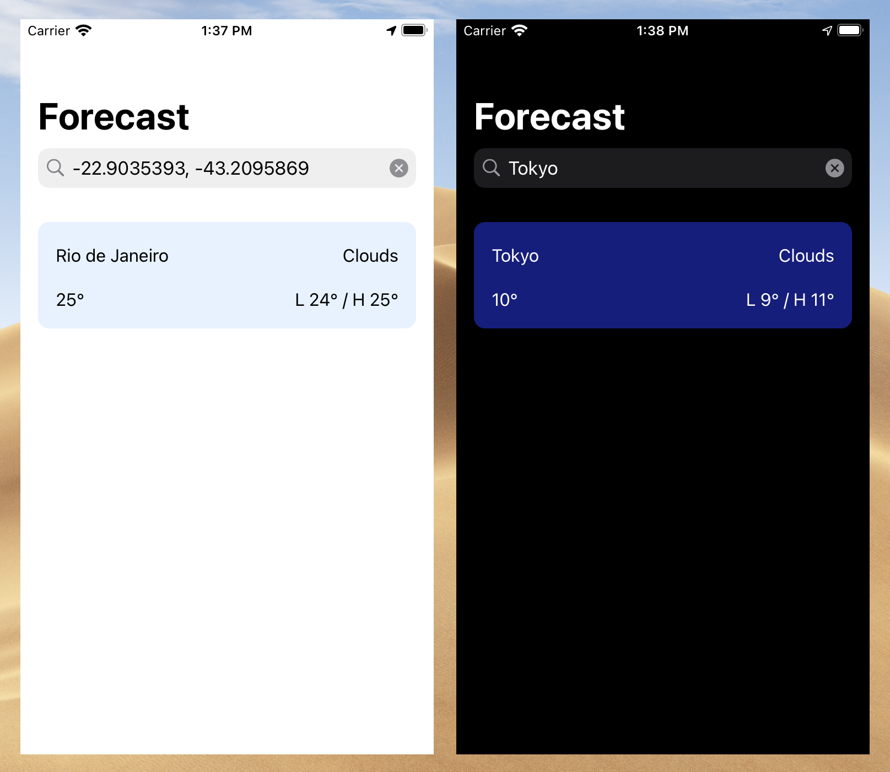

### Forecasts

A simple iOS weather app.

### Environment

Build using Xcode Version 12.1 (12A7403).

### Build Instructions

Open the project file and ⌘ + R.

### Improvements

- Increased unit test coverage.
- Improved error handling.
- Support presentation of multiple locations.
- Support searching by post code for countries other than Australia.

### Third Party Resources
- Simple throttling class. https://www.craftappco.com/blog/2018/5/30/simple-throttling-in-swift